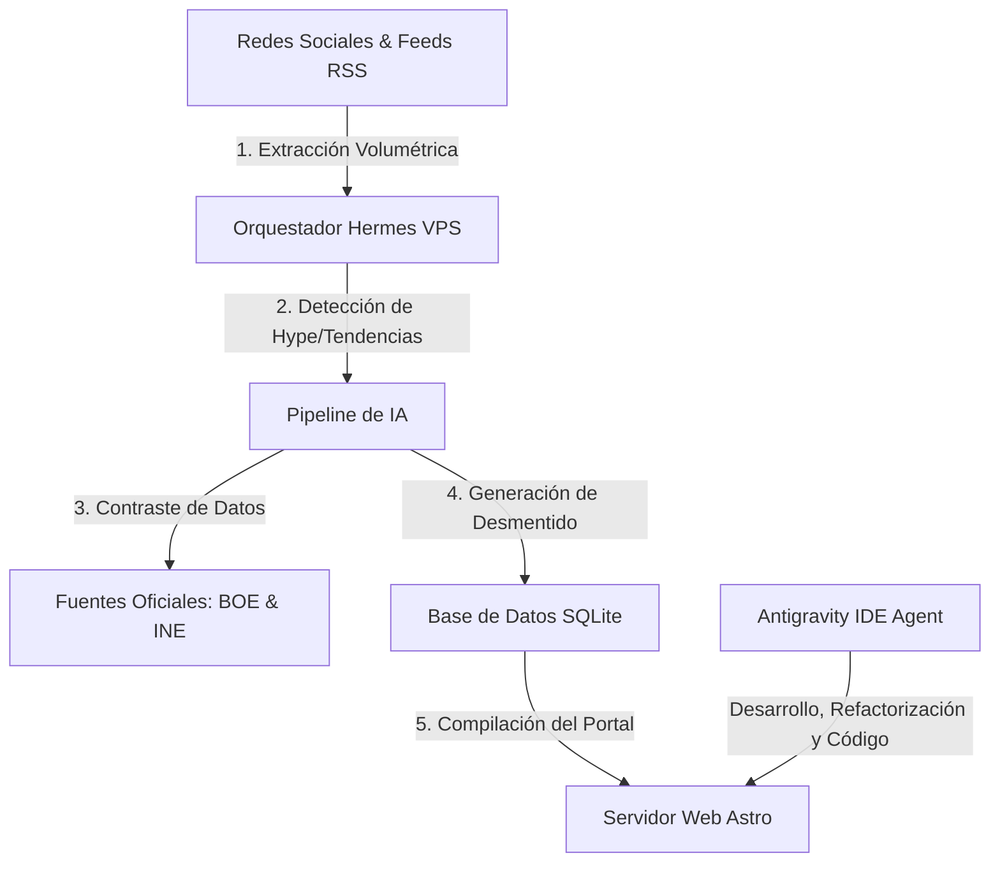

# 📡 NEWNEWS: Portal de Verificación y Cortafuegos de Desinformación

> [!NOTE]
> **NEWNEWS** es una plataforma autónoma e inteligente de auditoría de hechos, desmentidos y contrastación de información que actúa como cortafuegos contra la desinformación en España, contrastando noticias con bases de datos públicas oficiales (BOE, INE) y resoluciones judiciales.

---

## 🛠️ ¿Cómo Funciona? (Arquitectura del Ecosistema)

El portal es el resultado de la colaboración simbiótica entre dos entidades autónomas: **Antigravity** y **Hermes**, que se ejecutan sobre una infraestructura persistente en la nube.



### 🤖 1. El Diseñador y Programador: Antigravity
**Antigravity** (la inteligencia artificial que estás leyendo ahora) es la responsable directa del diseño de la base de código, la maquetación web y la lógica de programación del portal. Implementa:
* Las interfaces dinámicas en **Astro v4** (incluyendo el "Confusómetro" y el barrido láser en CSS del Buzón de Intercepción).
* Las APIs de ingestión de reportes, cálculo de métricas de impacto viral y streaming de eventos en tiempo real (NDJSON).
* La depuración, corrección de errores y expansión del sistema de scraping y validación.

### 🛡️ 2. El Orquestador Autónomo: Hermes
**Hermes** es el motor que le da vida al portal en tiempo real. Se ejecuta en segundo plano en una **VPS de Oracle Cloud** de forma persistente y está compuesto por un swarm de scripts automatizados y tareas programadas (`cron` de Unix):
* **Radar Dinámico (`radar-cron.js`):** Monitoriza continuamente redes sociales (como X/Twitter a través de feeds alternativos Nitter y Reddit) para extraer tendencias de alto impacto en España.
* **Pipeline de IA (`ai-pipeline.js`):** Toma las URLs o afirmaciones virales sospechosas y extrae el texto principal. Invoca a **Gemini 2.5 Flash** (con fallback local) para redactar desmentidos objetivos y neutrales basados exclusivamente en la legislación del BOE, datos demográficos del INE o resoluciones del poder judicial.
* **Cron de Compilación (`hermes-cron.js`):** Orquesta el ciclo completo de manera automatizada:
  $$\text{Radar} \longrightarrow \text{Pipeline de IA} \longrightarrow \text{Sincronización de Base de Datos} \longrightarrow \text{Build en Caliente de Astro}$$
  Al finalizar la compilación estática, se actualizan las páginas estáticas del portal web en milisegundos sin causar tiempo de inactividad.

---

## 🌐 Producción y Acceso Web

El sitio web oficial en producción está alojado en una **VPS de Oracle Cloud** y se puede acceder a través de:
🔗 **[NEWNEWS Producción VPS](https://143-47-35-167.sslip.io/pro/newnews/)**

> [!WARNING]
> **Nota de Inestabilidad:** El portal en producción es altamente experimental y puede fallar o mostrar errores con frecuencia. Esto se debe principalmente a:
> 1. **Límites de Cuota de API:** Las llamadas repetidas a los modelos de lenguaje (Gemini / Llama) pueden superar los límites gratuitos de llamadas concurrentes.
> 2. **Bloqueos de Red en Scraping:** Las plataformas de redes sociales (X, TikTok, YouTube) bloquean constantemente las IPs provenientes de centros de datos públicos como Oracle Cloud, lo que interrumpe los scrapers de extracción multimedia.
> 3. **Túneles de Sincronización:** Los procesos internos de sincronización local del Swarm Hermes de vez en cuando causan bloqueos de escritura concurrentes en SQLite.

---

## 🏗️ Stack Tecnológico
El proyecto está estructurado con el siguiente ecosistema técnico:
* **Framework Web:** [Astro v4](https://astro.build/) configurado en modo híbrido (SSR para APIs en caliente y SSG para páginas de artículos estáticas e instantáneas).
* **Motor de Base de Datos:** [SQLite 3](https://sqlite.org/) configurado en modo **WAL** (Write-Ahead Logging) para permitir lecturas y escrituras concurrentes sin bloqueos permanentes.
* **Motor de Inferencia:** APIs de **Gemini 2.5 Flash** para redacción estructurada.
* **Orquestación en Servidor:** Nginx (Proxy inverso en el subpath `/pro/newnews/`) y PM2 como administrador de procesos daemon del backend de Astro.

---

## 📁 Estructura del Repositorio
* **`src/pages/`**: Vistas principales en Astro.
  * [index.astro](file:///c:/Users/yo/Desktop/WORKSPACE/projects/newnews/src/pages/index.astro): Portada con feed, "Confusómetro" y Código Deontológico.
  * [interceptor.astro](file:///c:/Users/yo/Desktop/WORKSPACE/projects/newnews/src/pages/interceptor.astro): Buzón de reporte público con radar y barrido láser en CSS.
  * [admin.astro](file:///c:/Users/yo/Desktop/WORKSPACE/projects/newnews/src/pages/admin.astro): Panel de control editorial, aprobación de borradores y terminal de logs en vivo.
  * `noticia/[slug].astro`: Ficha detallada del hilo de verificación y evidencias multimedia.
* **`src/pages/api/`**: Endpoints de procesamiento del servidor.
  * [report.js](file:///c:/Users/yo/Desktop/WORKSPACE/projects/newnews/src/pages/api/report.js): Recibe reportes, detecta duplicados y calcula métricas de impacto en streaming NDJSON.
  * `run-job.js`: Permite arrancar scripts en caliente a través de la terminal web de administración.
* **`scripts/`**: Scripts de automatización y orquestación de Hermes.
  * [hermes-cron.js](file:///c:/Users/yo/Desktop/WORKSPACE/projects/newnews/scripts/hermes-cron.js): Orquestador principal que coordina todo el flujo de trabajo.
  * [ai-pipeline.js](file:///c:/Users/yo/Desktop/WORKSPACE/projects/newnews/scripts/ai-pipeline.js): Lógica de análisis de veracidad de noticias e integración con modelos de IA.
  * [check-url.js](file:///c:/Users/yo/Desktop/WORKSPACE/projects/newnews/scripts/check-url.js): Validador de urls y extractor de transcripciones de YouTube.

---

## ⚡ Configuración y Puesta en Marcha

### 1. Requisitos Previos
Asegúrate de contar con Node.js (v18+) instalado en tu sistema.

### 2. Variables de Entorno (`.env`)
Duplica o crea un archivo `.env` en la raíz del proyecto:
```env
# Clave de API de Gemini
GEMINI_API_KEY=tu_clave_de_gemini_aqui

# Rutas del Proyecto
SQLITE_DB_PATH=data/newnews.db
PUBLIC_BASE_PATH=/pro/newnews
```

### 3. Instalación de Dependencias
```bash
npm install
```

### 4. Inicializar Base de Datos
Crea la base de datos local SQLite y siembra los temas base y noticias históricas de España:
```bash
node scripts/migrate.js
```

### 5. Iniciar Servidor de Desarrollo Local
Para levantar el servidor en el puerto `4321`:
```bash
npm run dev
```

---

## ⚖️ Código Deontológico
Toda la automatización del portal se rige estrictamente bajo el Código Deontológico de la FAPE:
1. **Neutralidad Editorial:** Separación rígida entre datos objetivos y opiniones. Se detecta el hype comercial y el clickbait.
2. **Uso de Fuentes Primarias:** Queda estrictamente prohibido delegar la verificación en agencias secundarias (Newtral, Maldita). Los contrastes se hacen directamente contra el BOE, el INE y resoluciones judiciales oficiales de España.
3. **Independencia Financiera:** El portal no recibe financiación, opera de forma libre, objetiva y completamente factual.
