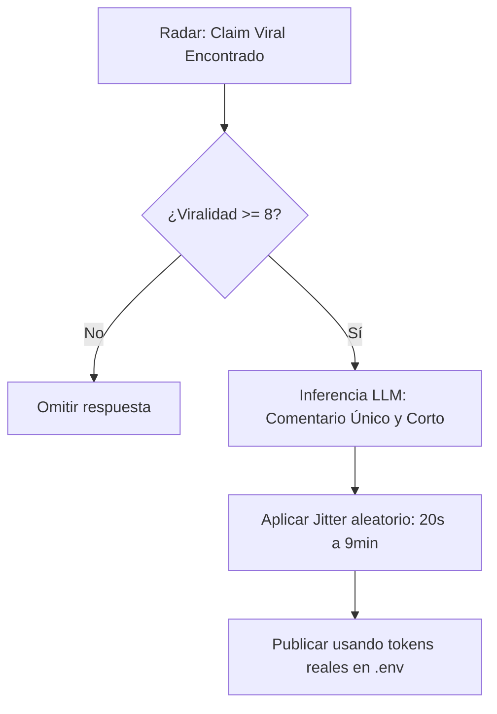

# ⚡ Flujo de Auto-Publicación e Integración Anti-Ban (Fase 09/10)

Para asegurar la fluidez durante las pruebas manuales y mantener la robustez ante rate limits y cuelgues del sistema, implementamos un flujo de publicación automatizada acelerada de claims y timeouts controlados.

---

## 1. Publicación Directa en Pruebas Manuales (Auto-Publish)
Por defecto, el motor del pipeline procesa las noticias de fondo en modo de revisión, guardándolas como `borrador` y encolando una tarea de revisión humana en la tabla correspondientes. 

Sin embargo, para agilizar el testeo de verificación en caliente:
*   Al pasar el flag `--item-id` (pruebas manuales de un claim del radar), el motor establece `status = 'publicado'` directamente en SQLite.
*   Esto provoca que el desmentido se compile y sea visible al instante en el portal sin pasos intermedios.

```javascript
const isTestItem = !!itemId;
const statusVal = (autopilot || isTestItem) ? 'publicado' : 'borrador';
const reviewVal = (autopilot || isTestItem) ? 0 : 1;
const pubAtVal = (autopilot || isTestItem) ? new Date().toISOString() : null;
```

---

## 2. Gestión de Timeouts e Inferencia Resiliente
Para prevenir bloqueos de CPU por subprocesos o APIs con latencia en la VPS, las llamadas de red nativas de Hermes a los modelos de lenguaje están limitadas temporalmente:

*   **Timeout Global**: Establecido a **120 segundos** (`120000ms`). Permite la inicialización de Hermes en la CPU del VPS sin cuelgues prematuros.
*   **Filtro de Reintentos de Inferencia (Fase 07/08/09)**: Si el modelo predeterminado da error o expira por rate limits, el catch desvía la petición de forma instantánea al fallback secundario gratuito de Stepfun (`stepfun/step-3.7-flash:free` a través del proveedor `nous`), garantizando que la redacción se complete con éxito en menos de 5 segundos.

---

## 3. Orquestación Social Responder (Estrategia Anti-Ban)
El módulo `scripts/social-responder.js` publica comentarios reales en redes sociales sin simulaciones, apoyándose en la siguiente estrategia segura de Hermes:



*   **Jitter Humano**: Espaciado aleatorio de llamadas antes de enviar la petición de comentario.
*   **Validación de Sesión Real**: Comprobación obligatoria de cookies y tokens en el `.env` (detiene la ejecución si son simulados o nulos), evitando la actividad inauténtica automatizada que genera suspensiones inmediatas en redes sociales.
