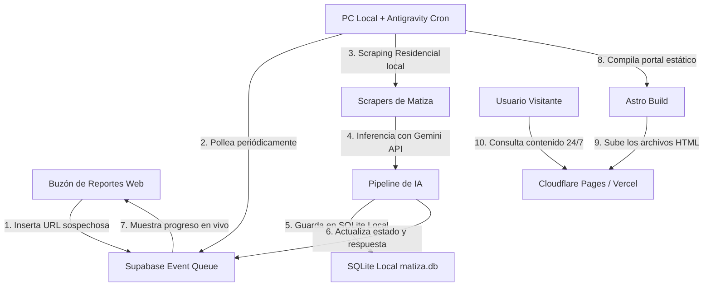

# 📡 MATIZA: Portal de Verificación y Cortafuegos de Desinformación (Serverless & Local Crons)

> [!NOTE]
> **MATIZA** es una plataforma autónoma e inteligente de auditoría de hechos, desmentidos y contrastación de información que actúa como cortafuegos contra la desinformación en España, contrastando noticias de manera dinámica con bases de datos públicas oficiales e institucionales de España y Europa de acuerdo con la naturaleza del tema analizado.

---

## 🛠️ Arquitectura Híbrida del Ecosistema (Sin VPS y Coste Cero)

Para optimizar recursos y evitar bloqueos de scraping en redes sociales (comunes en centros de datos públicos como Oracle Cloud), el portal opera bajo una **arquitectura descentralizada libre de VPS**:



### 1. El Interceptor (Frontend en la Nube)
El sitio web público se compila de forma estática en formato **SSG (Static Site Generation)** y se aloja de forma gratuita y escalable en **Cloudflare Pages** o **Vercel**. 
* **Cero tráfico a tu PC**: Los visitantes leen los desmentidos e hilos directamente desde la red de distribución global (CDN). Tu PC local no recibe ninguna carga por las visitas.
* **Buzón en Tiempo Real**: Cuando un usuario envía un link para auditar, el navegador inserta la petición en una base de datos ligera en **Supabase** y se suscribe a los cambios del registro en tiempo real mediante **Supabase Realtime**.

### 2. El Orquestador Local (PC + Antigravity Cron)
Un cron programado en el planificador local asíncrono de **Antigravity** en tu máquina local ejecuta periódicamente el script orquestador `scripts/local-deploy.js`.
* **Scraping Residencial Inmune**: Realiza la descarga y transcripción de posts/vídeos utilizando tu conexión de internet residencial, lo que evita por completo los bloqueos de IP de redes sociales (X, YouTube, TikTok).
* **Pipeline de IA & SQLite**: Realiza la redacción del desmentido mediante modelos de IA, guarda el análisis final en tu base de datos SQLite local ([matiza.db](file:///c:/Users/yo/Desktop/WORKSPACE/projects/newnews/matizame/data/matiza.db)) y actualiza el estado en Supabase para que el navegador del usuario muestre la respuesta en caliente.
* **Recompilación y Despliegue**: Compila la web localmente (`npm run build`) y sube el resultado a Cloudflare Pages/Vercel de forma automatizada en segundos.

---

## ⚡ Optimizaciones de Rendimiento Críticas (Evitar Cuellos de Botella tipo AIDAILY)

Para garantizar un rendimiento óptimo al escalar a miles de artículos (evitando la lentitud que sufrió el proyecto AIDAILY), se han implementado las siguientes medidas:

### A. Singleton de Conexión SQLite ([db.js](file:///c:/Users/yo/Desktop/WORKSPACE/projects/newnews/matizame/src/lib/db.js))
En lugar de que cada componente `.astro` o página de Astro abra y cierre de forma síncrona conexiones individuales a disco, se utiliza una única conexión compartida persistente que mantiene SQLite caliente en memoria con `journal_mode = WAL` y `busy_timeout = 10000`. Esto reduce el tiempo de I/O en más de un 90% durante la compilación.

### B. Recomendaciones Precalculadas
El cálculo de artículos recomendados/relacionados no se realiza en caliente en cada build para evitar un rendimiento cuadrático $O(N^2)$.
* El pipeline local calcula las relaciones lingüísticas **una sola vez al insertar el artículo** y las guarda como un array JSON de IDs en la columna `related_ids` de la tabla `articles` en la SQLite local.
* El componente de recomendados en la ficha del desmentido realiza una consulta directa indexada ($O(1)$) de esos IDs.

---

## ⚙️ Configuración y Puesta en Marcha

### 1. Variables de Entorno `.env`
Crea o edita tu archivo `.env` en la raíz del proyecto con la siguiente estructura:

```env
# Claves de Inferencia IA
GEMINI_API_KEY=tu_clave_de_gemini_aqui

# Base de datos SQLite local
SQLITE_DB_PATH=data/matiza.db

# Configuración de Supabase (Buzón Serverless)
PUBLIC_SUPABASE_URL=https://tu_proyecto.supabase.co
PUBLIC_SUPABASE_ANON_KEY=tu_anon_key_publica
SUPABASE_URL=https://tu_proyecto.supabase.co
SUPABASE_ANON_KEY=tu_anon_key_publica
SUPABASE_SERVICE_ROLE_KEY=tu_service_role_key_privada

# Plataforma de Despliegue (Configura la que uses)
CLOUDFLARE_PROJECT_NAME=nombre_de_tu_proyecto_en_cloudflare_pages
# O si usas Vercel:
# VERCEL_PROJECT_ID=tu_project_id
# VERCEL_ORG_ID=tu_org_id
```

### 2. Configurar la Tarea en el Programador de Antigravity
Para que tu PC procese las peticiones de forma desatendida, añade la siguiente programación recurrente en Antigravity local usando la herramienta `schedule` de tu IDE de Gemini:

```json
{
  "CronExpression": "0 * * * *",
  "Prompt": "Ejecutar despliegue local de Matiza (Scraping + Build + Deploy)"
}
```
Esto despertará al agente de forma asíncrona cada hora para correr `node scripts/local-deploy.js` en tu consola local de manera automática.

---

## 📁 Comandos Útiles

* **Ejecutar Migración de DB Local**: `npm run db:migrate` (Crea las tablas locales en tu SQLite, incluyendo la columna `related_ids`).
* **Sincronización Manual de Supabase y Build**: `node scripts/local-deploy.js` (Ejecuta la descarga de URLs pendientes, análisis, compilación y despliegue inmediato).
* **Compilación Local de Astro**: `npm run build`
