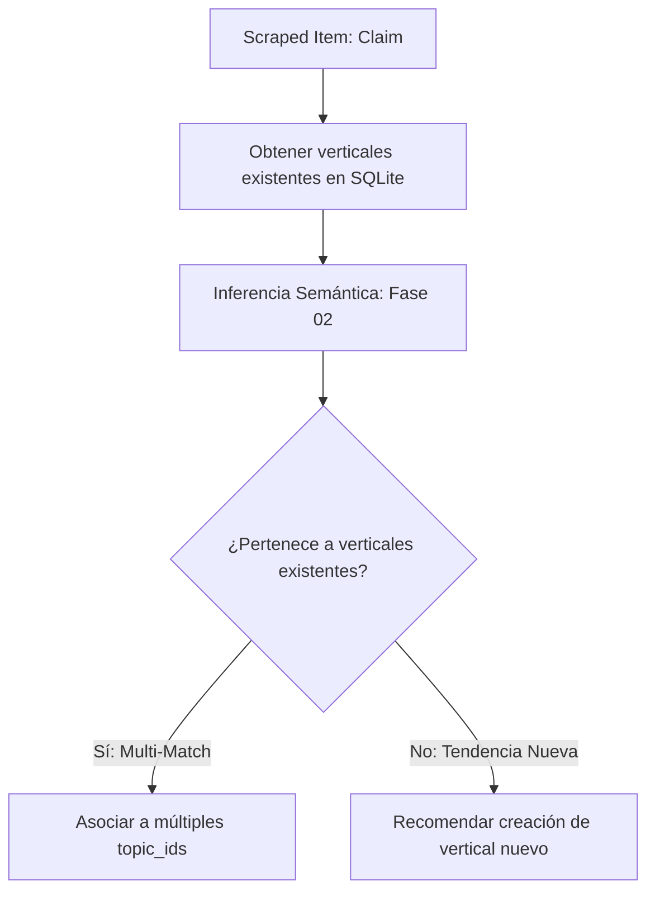

# 🚦 Enrutador Semántico Multi-Expediente (Fase 02)

El Enrutador Semántico es el módulo de inteligencia artificial encargado de categorizar dinámicamente un claim detectado en redes sociales. Su objetivo es clasificar el hecho dentro de uno o varios expedientes temáticos vivos en Matiza.

---

## 1. Flujo de Trabajo y Enrutamiento
Al recibir un claim fáctico, el pipeline extrae los expedientes activos en el sistema y ejecuta la inferencia semántica para buscar afinidades cruzadas:



---

## 2. Estructura del Prompt de Clasificación
El prompt obliga a la IA a analizar el claim en base a los verticales existentes y a devolver un JSON con la matriz de coincidencias y grado de confianza:

```markdown
CLAIM A CLASIFICAR:
"[Claim detectado]"

VERTICALES DISPONIBLES:
[Lista de IDs, Títulos y Descripciones de los Expedientes Vivos]

--- INSTRUCCIONES ---
1. Asocia el claim a todos los verticales existentes donde encaje de forma justificada.
2. Si el claim abarca múltiples temáticas (ej: burocracia e impuestos y vivienda), regístralo tanto en el vertical de 'Vivienda y Alquileres' como en el de 'Autónomos e Impuestos'.
3. Devuelve los verticales recomendados en el array "topic_matches" con sus niveles de confianza.
```

---

## 3. Esquema de Salida JSON Requerido
La respuesta debe ajustarse de forma estricta a este esquema JSON:

```json
{
  "content_type": "Rumor",
  "claim_type": "Económico",
  "topic_matches": [
    {
      "existing_topic_id": "ley-de-vivienda-alquileres",
      "confidence": 0.95
    },
    {
      "existing_topic_id": "t-autonomos",
      "confidence": 0.85
    }
  ],
  "category_tags": ["Vivienda", "Fiscalidad", "Juventud"],
  "needs_new_topic": false,
  "routing_reason": "El claim debate el precio del alquiler en jóvenes y la burocracia para emprender, solapando ambos expedientes."
}
```

---

## 4. Persistencia en SQLite
El primer elemento de `topic_matches` se considera el tema principal (columna `topic_id` en la tabla `articles`). Todos los elementos del array con una confianza razonable se insertan de forma interactiva en la tabla asociativa `article_topics` para asegurar la conectividad semántica de la noticia en la web.
